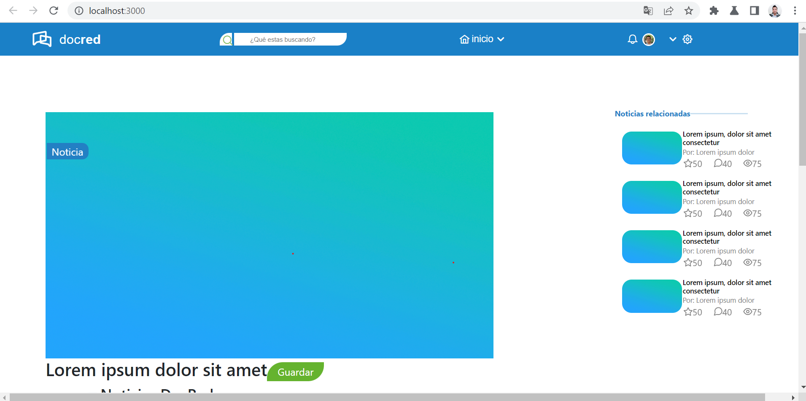
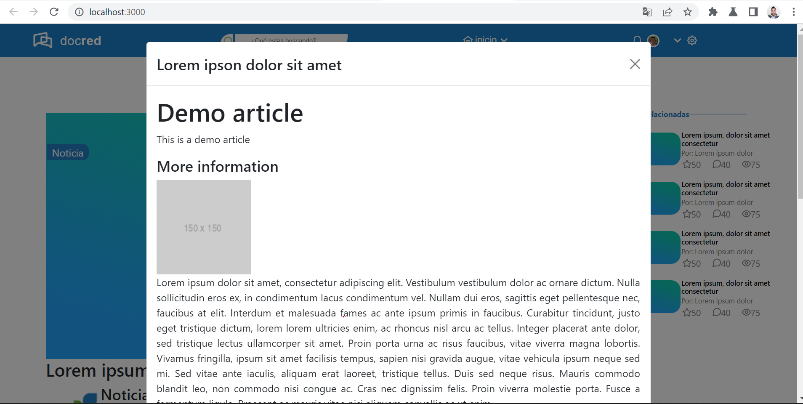

# DocRed Frontend test
Este es un simple test para determinar tus conocimientos y habilidades de Frontend.

## Como empezamos?
Haz un fork de este repositorio para trabajar en él.
Una vez completada la tarea, envíanos la URL de tu repositorio a nuestro email.

## Consignas

Antes que nada, lee bien las consignas. Este test debe reflejar no sólo tus conocimientos en technología, pero también tu forma de trabajar.
Haz commit de tus cambios regularmente, esto también refleja cómo trabajas.

En total no debería tomarte mas de 1 día, pero usa tu tiempo sabiamente.

## Que debes hacer?

Intenta reproducir el mock-up que encuentras en `mockup/DocRed-mockup.png` lo más cercano posible.
Crea una version responsive del mock-up.
Presta atención a los detalles.

El trabajo final debe mostrar un artículo como en el mock-up. Esperamos que los botones sean botones y los links sean links aunque estos no lleven a ningún lado.

El contenido del artículo debe ser cargado desde el archivo `mockup/article.json` dinámicamente.

Se debe agregar al final de este README las instrucciones sobre cómo correr el proyecto.

Tecnologías que debes usar
----
- ReactJS (Con Hooks preferentemente)
- SASS (o styled-components preferentemente)

Puntos extras:
----
- NextJS y Typescript.
- Unit testing.
- Linting y Prettier
- Docker

## Instrucciones para instalación de dependencias

1. ubicarse en la carpeta docred-app mediante el uso de comandos y ejecutar `npm i` para realizar la instalación de dependencias
   **Nota: Es importante tener en cuenta que para este proyecto se utilizo node en la version 16.13.2 y npm en la version 8.1.2**

2. Para ejecutar el programa en la consola se debe poner el comando `npm run start` despues de haber instalado dependencias

3. Para lanzar el servidor ubicarse en la carpeta web server, abrir la consola y ejecutar `npm i`

4. Para levantar el servidor ejecutar en la consola `npm run dev`

**Nota: Para poder realizar la peticion al servidor debemos configurar el archivo variables que se encuentra dentro de la carpeta src/config/variables y modificar la ip**

- Para poder modificar la Ip teclear la imagen de Windows + R -> Seguido agregar cmd -> en la consola agregar ipconfig y poner la ip local en el archivo variables de la aplicacion docred-app

Se dejo la carga de la peticion en el boton de la pagina inicial llamado Noticia y debe abrir el modal con el contenido del articulo.

Gracias.

--------------------------------------

